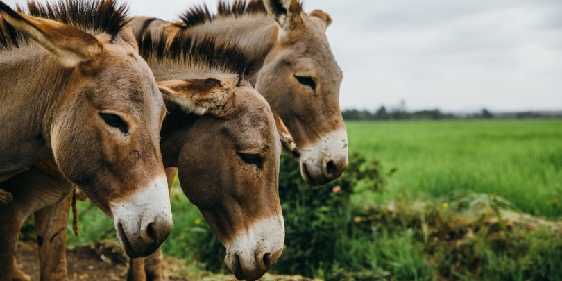

```{r, echo=FALSE, include=FALSE}
library(kableExtra)
library(knitr)
library(tidyverse)
```



# Learning Objectives

- refine skills in expressing models mathematically
- practice model building and evaluation of model performance
- explore usage of non-symmetric loss functions tailored to a problem's characteristics
- weigh trade-offs between simple, easy-to-use models and those with the best predictive performance

# Case Study Goals

- Identify an excellent model for predicting donkey weight based on data easily obtained in the field.
- Provide a comprehensive interpretation of your model, explaining how the field data are used to predict weight, in language accessible to a typical student in veterinary school.
- Compare the fit of your model with that of a model corresponding to the procedure proposed by Milner and Rougier. If you find your model superior in fit, discuss whether you would recommend its routine use in the field and provide simple tool for doing so.

# Data

- Data for this case study are in the public domain and available on Sakai, as well as in the R package *paranomo*.

# Assignments and Reports

- Writing models (Individual assignment due 5/18): Express the algorithm proposed by Milner and Rougier as a linear regression model, providing the estimate and interpretation of each \beta in the model, using language clearly accessible to a student in veterinary school. (You do not have to fit any model, just obtain the $\beta$ values from the text.) Discuss how the authors assessed their algorithm's validity.

- Report, reproducible code, and video (Group assignment due 5/21): produce a 8 page (maximum) report using R markdown that clearly addresses the case study goals. This report should follow the format of a standard scientific report and should include sections for the introduction, methods, results, and discussion. The methods section should clearly identify the approach to model selection and evaluation, and the results section should clearly specify the final model selected, along with evidence the model provides a good fit to the data. Code should be fully reproducible.

- Peer review of reports (Individual assignment due 5/22): using the peer review rubric provided, provide constructive feedback on the other group's report you have been assigned

- Revised report and response to reviews (Group assignment due 5/26): groups may submit revised reports and must submit a point-by-point response to the review comments provided


# Resources

Milner K and Rougier J. (2014) [How to weigh a donkey in the Kenyan countryside.](https://rss.onlinelibrary.wiley.com/doi/pdf/10.1111/j.1740-9713.2014.00768.x) *Significance*, October 2014, 40-43.

[Rougier's donkey project website](https://people.maths.bris.ac.uk/~mazjcr/#donkeys)

Excerpts from preprint of Nolan and Stoudt's *Communicating with Data: The Art of Writing for Data Science* are availble in the Sakai folder for the case study. These excerpts deal with the structure of a statistical report and how to describe data, and use Milner and Rougier (2014) as an example throughout.

*Introduction to Statistical Learning* Section 5.1 (link on Sakai site)

# Video Lectures

[Scientific writing]

[What is a good model?]

[Cross-validation]

[Loss functions]

[Simulation]


