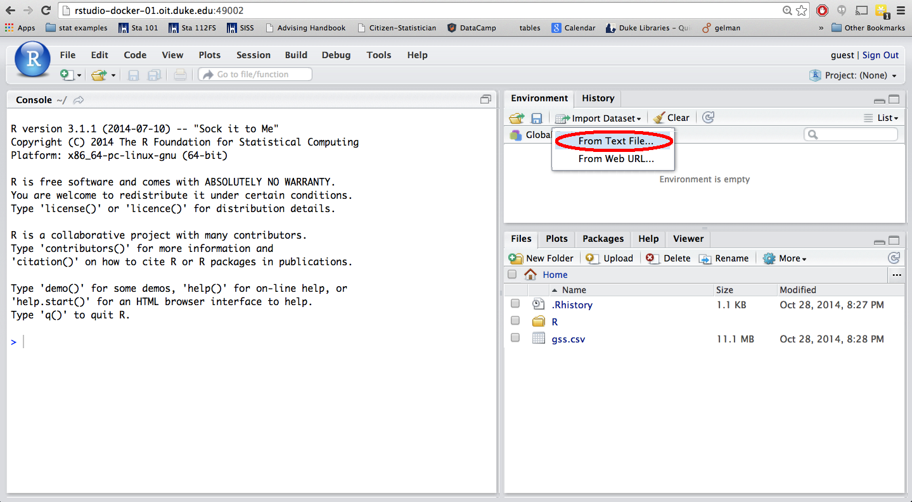

```{r setup, include=FALSE}
knitr::opts_chunk$set(echo = TRUE)
```

This page (which has been initialized with questions common from previously offered 101 courses) will be updated as the class progresses with common questions I receive from students. I recommend that you check this page when you have a question to see if it has already been answered. If not, post to Piazza, and if it is something that has commonly come up in office hours or receives a lot of responses I'll post it here as well. Note that references are to the [OpenIntro Statistics, 4th Edition](https://www.openintro.org/).

### Logistics:

1. [What are the links for the tools I need for the class?](#l1)
2. [Do I need to pay for Coursera, or worry about Coursera due dates?](#l2)
3. [Where should I ask my question about a lab, problem set, or assignment?](#l3)

### Conceptual:

1. [What is the difference between an explanatory and response variable?](#c1)
2. [What exactly is a confounding variable?](#c2)
3. [What exactly is the difference between stratified sampling and cluster sampling?](#c3)
4. [What is meant by a ``typical" observation?](#c4)
5. [If a distribution is extremely skewed or has extreme outliers should we use the standard deviation to describe the variability since it will take into account these extreme observations as well?](#c5)

### R related:

1. [My lab report gives an error when I click on KnitPDF and it doesn't compile OR it does, however my code, plots, output do not show up in the compiled document. What is going on?](#r1)
2. [If I have counts for categorical data in a table form how do I recreate the data in R?](#r2)
3. [My dataset is in a CSV or RData file on my computer. How can I get it into RStudio?](#r3)
4. [How can I export my .Rmd file so that I can submit it on Sakai?](#r5)
5. [How can I take a random sample of cases from my dataset?](#r6)
6. [How can I make a plot visualizing the relationships between all of the variables in my dataset?](#r7)
7. [How can I calculate confidence intervals for the slopes in linear regression using R?](#r8)
8. [How can I create a new variable based on values in an existing variable in my dataset?](#r9)
9. [How can I resize my plots in RMarkdown?](#r10)

### General:

1. [What is and isn't allowed on the midterms and final?](#g1)
2. [I won't have internet for a day, what do I do about turning in problem sets / labs / etc?](#g2)
3. [Is the final cumulative?](#g3)

* * *
### Logistics:
* * *

<a name="l1">1. What are the links for the tools I need for the class?</a>

- Course website: https://kelrenmor.github.io/STA101-002/
- Sakai: https://sakai.duke.edu/
- Piazza: https://piazza.com/duke/summer2020/sta10102l1su20/
- RStudio: https://vm-manage.oit.duke.edu/containers
- Coursera: https://online.duke.edu/coursera-for-duke/
- Gradescope: https://www.gradescope.com/saml

* * *

<a name="l2">2. Do I need to pay for Coursera, or worry about Coursera due dates?</a>

Short answer: No, and no!

When you register for the Coursera course, you may notice assignments and deadlines posted on Coursera itself. You can ignore these (though of course are welcome to do the practice questions if you wish)! We will be using Coursera for videos and learning objectives, not assignments. All graded work for the class will be specified on the course website and linked to directly from there (or you will be told to see assignment description on Sakai): https://kelrenmor.github.io/STA101-002.

Coursera courses are free to Duke students. To make sure you are recognized as a Duke student, sign up with your NetID via https://online.duke.edu/coursera-for-duke/. If you would prefer to use a non-Duke email for your Coursera login, you will still be able to sign up to "audit" the Coursera course for free.

* * *

<a name="l3">3. Where should I ask my question about a lab, problem set, or assignment?</a>

If your question is non-personal (e.g., 'What does the axis label mean on probelem 2?') post to Piazza. If your question is sensitive or personal (e.g., 'I have been having conflicts with my group over lab work division') reach out via email or come to office hours and let me know you would like to discuss something privately.

* * *
### Conceptual:
* * *

<a name="c1">1. What is the difference between an explanatory and response variable?</a>

To identify the explanatory variable in a pair of variables, identify which of the two is suspected of affecting the other. We're saying ``suspected" here because in order to make a causal statement we need to have a randomized experiment. But these terms are defined for all types of studies. For example, let's say we're interested in finding out if studying for an exam with the TV on affects exam performance. Below are two studies investigating this issue:

* At the beginning of an exam ask students if they have studied for the exam while also watching TV. Once the exams are graded, compare the average exam scores of those who studied with the TV on and those who studied without.
* Randomly assign a group of students to study for an upcoming exam while watching TV and others to study without the TV on. Once the exams are graded, compare the average exam scores of those who studied with the TV on and those who studied without.

In both scenarios the explanatory variable is studying with the TV on or off, and the response variable is exam score. However in the first scenario we have an observational study. Therefore even if we find a significant difference between the average scores of the two groups, we can't make a causal connection between watching TV and exam performance. The second study is a randomized experiment, therefore a causal connection can be made between the explanatory and response variables.

*Review section 1.2.4 for more information.*

* * *

<a name="c2">2. What exactly is a confounding variable?</a>

A confounding variable (also called a lurking variable) is a variable that is correlated with both the explanatory and response variables. Confounding variables are basically the reason why we cannot make causal connections between the explanatory and response variables in observational studies. For example, a study has found that the 20 year survival rate (how likely is a subject to be alive in 20 years) for smokers was higher than that of non-smokers, which seems to indicate that smokers are less likely to die. This seems to contradict what we know about the health effects of smoking. A closer look at the data shows that majority of the smokers were young people, and majority of the non-smokers were old people. In this case age seems to be a confounding variable. What is causing the survival rate to appear lower for the smokers is that they're younger (hence more likely to live longer), not that smoking is good for you. Another example on sunscreen use and skin cancer is provided in the textbook.

*Review section 1.3.4 for more information.*

* * *

<a name="c3">3. What exactly is the difference between stratified sampling and cluster sampling?</a>

In both cases we first divide our target population into smaller groups. The main difference between stratified and cluster sampling is that in stratified sampling the groups (strata) are homogeneous with respect to a variable we think might have an effect on the response variable. For example, say we're studying the effect of of watching TV on academic performance at a particular college. We might want to make sure that we include equal numbers of first-years, sophomores, juniors, and seniors in our study. So we divide up our target population into four strata based on year, and randomly sample students from within each sample. This will probably require getting a list of all students from the registrar, randomly picking a given number of students from each year, and finding these students and collecting information on how much they watch TV and their academic performance, like GPA. Sounds like a tedious process... Alternatively we might randomly pick a few courses from the list of all courses offered at this college and go to the classrooms for these students and sample everyone in each of the classes we picked. In this case the classes are the groups (clusters), and they're probably not homogeneous groups. We simply picked them to make data collection a little more manageable.

*Review section 1.3.5 for more information.*

* * *

<a name="c4">4. What is meant by a ``typical" observation?</a>

Depending on the shape of the distribution the typical observation can be the mean (symmetric) or the median (skewed).

* * *

<a name="c5">5. If a distribution is extremely skewed or has extreme outliers should we use the standard deviation to describe the variability since it will take into account these extreme observations as well?</a>

Au contraire, you want to use the IQR in this case to describe variability in distributions with extreme observations. The IQR is robust to these observations, and this is preferred because we want statistics that describe the bulk of the data. However, as usual when describing distributions, you should always mention shape, center, spread, and unusual observations. So these extreme cases, which may be the most interesting ones, still get their place in the spotlight, we just don't want to factor them into the calculation of statistics that describe the distribution as a whole.

*Review section 2.1.6 for more information.*

* * *
### R related:
* * *

<a name="r1">1. My lab report gives an error when I click on KnitHTML and it doesn't compile OR it does, however my code, plots, output do not show up in the compiled document. What is going on?</a>

There are two common errors, first check if your issue is related to one of these:

1. 
    * Error: > sign in code chunks in lab report - This sign in R means it's done processing the previous command and is ready to accept another. When you copy and paste your code from the console to your lab document you should not include that sign.
    * Solution:</font> Get rid of > signs at the beginning of your commands in your lab report and reprocess. If this was the only issue, it should now be resolved, and your document should now look how you expect it to.
2. 
    * Error: code outside of chunk - In your markdown document all R code should be in code chunks indicated by the three ticks and the `{r}` (it is highlighted in a light gray band). If you insert your code outside of these allotted code chunk areas, the code won't process and the document might give you an error or might just not look how you expect it to.
    * Solution: Place all code in the allotted code chunks. If this was the only issue, it should now be resolved, and your document should now look how you expect it to.

If your problem isn't related to one of these, send me an email with your lab report document attached, or copy and paste your entire lab report at the bottom of your email and I'll help you figure out the issue.

* * *

<a name="r2">If I have counts for categorical data in a table form how do I recreate the data in R?</a>

You can make use of the `rep()` (repeat) function in R to do this. 

Here is a small example. Let's say I have the following contingency table: 

|---------------+---------+-------------+-------|
|               | married | not married | total |
|:-------------||:-------:|:-----------:|:-----:|
| **mature mom**| 25      | 107         | 132   |
| **younger mom**| 361     | 506         | 867   |
| **total**     | 386     | 613         | 999   |
|---------------+---------+-------------+-------|  

In order to recreate a data set where each row represents one respondent, use the following code: 

~~~~~~~~~~
mature = c(rep("mature mom", 132), rep("younger mom", 867))
married = c(rep("married", 25), rep("not married", 107), rep("married", 361), rep("not married", 506))
~~~~~~~~~~

You can make a table using the following code to double check that the data looks like the original contingency table. 

~~~~~~~~~~
table(mature, married)
~~~~~~~~~~

You can also create a new data set where these data are variables make up the columns of the data frame.

~~~~~~~~~~
momdata = as.data.frame(cbind(mature,married))
~~~~~~~~~~

Once you have your data you can write it out to a .csv file using the following. 

~~~~~~~~~~
write.csv(momdata, file = "moms.csv", quote = FALSE, row.names = FALSE)
~~~~~~~~~~

You should now see a file called *mom.csv* in the Files window. You can select that file and export it (check the box next to the file, click on More, and then Export...) so that you can have a copy of this file on your computer, and can submit it with your project. For more information on the `write.csv()` function, use the following. 

~~~~~~~~~~
?write.csv
~~~~~~~~~~

* * *

<a name="r3">3. My dataset is in a CSV or RData file on my computer. How can I get it into RStudio?</a>

Under the Files tab in the bottom right corner of RStudio you should see a button called Upload (with a yellow up arrow). Click on that, and then click on Choose File and find your data file and hit OK. You should then see this file listed in the Files window. 

This means that you have successfully uploaded your file to RStudio, but it's not yet in your Workspace. Loading the dataset to your website requires slightly different methods depending on if it's a CSV or RData file.

**CSV file:** Click on Import Dataset (under the Workspace tab on the top right corner of RStudio), then click on From Text File... 



and choose your data file from the list. Make sure the radio button for Heading is selected for Yes (assuming that the first row of your dataset is the header row).


In order to use this dataset as a part of your write up, you need to include a piece of code in your .Rmd file to read the data in. Suppose your data file's name is "d_prj1.csv", and you want to call your dataset "d" then use the following: 

~~~~~~~~~~
```{r, eval=F}
d = read.csv("d_prj1.csv")
```
~~~~~~~~~~

You can also simply copy and paste the code R automatically generates when you import the data file into an R chunk in your markdown document.

**RData file:** Since an RData file is already formatted for R, it takes fewer steps to load this type of data. In fact, it's only two steps. Just click on the file in your Files pane. This will prompt a pop-up window asking whether you want to load the R data file into the global environment. Click Yes, and your data should be ready for use.

In order to use this dataset as a part of your write up, you need to include a piece of code in your .Rmd file to read the data in. Suppose your data file's name is "d_prj1.Rdata", use the following: 

~~~~~~~~~~
```{r, eval=F}
load("d_prj1.Rdata")
```
~~~~~~~~~~

You can also simply copy and paste the code R automatically generates when you import the data file into an R chunk in your markdown document.


* * *

<a name="r5">5. How can I export my files (like HTML or Rmd files) from RStudio so that I can submit it on Sakai?</a>

Locate the file you want to export in the Files pane (lower right corner), check the box next it, then click on More -> Export, and then click on Download in the pop-up window. 


* * *

<a name="r6">6. How can I take a random sample of cases from my dataset?</a>

Let's assume you want a random sample of 1000 observations, and you want to sample without replacement. 

This is a two step process:

* First, generate random numbers between 1 and the number of rows in your original dataset, and store these.

~~~~~~~~~~
rows_to_sample = sample(1:nrow(original_data), 1000, replace = FALSE)
~~~~~~~~~~

* Then, grab the rows corresponding to the random numbers from the previous step, and store them in a new data set.

~~~~~~~~~~
samp_data = original_data[rows_to_sample, ]
~~~~~~~~~~

* * *

<a name="r7">7. How can I make a plot visualizing the relationships between all of the variables in my dataset?</a>

The simplest approach is to use the plot function on the entire dataset. The second approach is to use a new function from a contributed R package to get a much fancier plot. The two downsides with the second option are (1) It doesn't handle NAs automatically (this may not be an issue with your second project since there aren't many NAs), and (2) it takes a while to generate the plot so you'll need to be patient. The examples below use the built in USArrests data from R.

* `plot` function:

~~~~~~~~~~
data(USArrests)
plot(USArrests)
~~~~~~~~~~

In this output you'll see that the lower diagonal of the plot matrix has repetitive information from the upper diagonal (same plots, with axes reversed). Also, depending on the number of variables you have, the plots may be small. If R complains about the plotting window being too small, just increase the size of your plotting window by dragging the margins in RStudio. You can use this to quickly determine which variables are related, then make single plots for those relationships that you'd like to view more closely. If you want to plot only certain variables, you can first make a subset, and then use the plot function.

*Subsetting based on column number:* Only plot relationships between variables in columns 1 and 2.

~~~~~~~~~~
plot(USArrests[,1:3])
~~~~~~~~~~

*Subsetting based on variable names:* First subset the data selecting variables by name, and them plot the relationships between them.

~~~~~~~~~~
USArrests_plot = subset(USArrests,select = c("Murder","Assault","UrbanPop","time_to_work"))
plot(USArrests_plot)
~~~~~~~~~~

\\
* `ggpairs` function from the GGally package:

~~~~~~~~~~
install.packages("GGally")  # install package
library(GGally)             # load package
ggpairs(USArrests)
~~~~~~~~~~

If you only want to plot certain columns of the dataset (say, 1 through 3), use

~~~~~~~~~~
ggpairs(USArrests, columns = c(1:3))
~~~~~~~~~~

* * *

<a name="r8">8. How can I calculate confidence intervals for the slopes in linear regression using R?</a>

You can calculate confidence intervals for slopes manually (finding the appropriate t* for the degrees of freedom and confidence level you need), or you can use the `confint` function in R. The example below uses the built in USArrests data from R. You can either get confidence intervals for all slopes using:

~~~~~~~~~~
m = lm(Murder ~ UrbanPop + Assault, data = USArrests)
confint(m)
~~~~~~~~~~

or for one parameter at a time using:

~~~~~~~~~~
confint(m, parm = "Assault")
~~~~~~~~~~

Use the help file for the function to figure out how to change the confidence level.

~~~~~~~~~~
?confint
~~~~~~~~~~

* * *

<a name="r9">9. How can I create a new variable based on values in an existing variable in my dataset?</a>

Note that methods discussed in this answer can be used for combining levels of a categorical variable, or creating a categorical variable based on a numerical variable, etc.

Let's illustrate this using the built-in USArrests dataset in R:

~~~~~~~~~~
data(USArrests)
~~~~~~~~~~
<br>
**numerical -> categorical:** Let's create a new variable based on an existing numerical variable. A quick peek at the summary statistics for the `Murder` variable in this dataset tells us that the median number of murder arrests per 100,000 is 7.25 and the 3rd Quartile is 11.25. Suppose we're interested in whether the murder arrest rate is below the median, between the median and 3rd quartile, or above the 3rd quartile. We'll store this information in a new variable we call `murder_cat`.

~~~~~~~~~~
USArrests$murder_cat[USArrests$Murder > 11.25] = "above 3rd Q"
USArrests$murder_cat[USArrests$Murder > 7.25 & USArrests$Murder <= 11.25] = "between median and 3rd Q"
USArrests$murder_cat[USArrests$Murder <= 7.25] = "at/below median"
~~~~~~~~~~
<br>
Once again, we need to ensure that the new variable is treated as a categorical variable (rather than just a character string).

~~~~~~~~~~
USArrests$murder_cat = as.factor(USArrests$murder_cat)
~~~~~~~~~~
<br>
We can see in the summary output for this variable the number of people whose time work are above median or at or below median as well as that there were some NAs in the dataset that were left as is.

~~~~~~~~~~
summary(USArrests$murder_cat)
   above 3rd Q          at/below median between median and 3rd Q 
                      13                       25                       12 
~~~~~~~~~~
<br>
**categorical -> categorical:** Suppose we don't actually want this fine grained information and we're just interested in whether the murder rate is scary or not scary, i.e. whether it is above the 3rd quartile or not. In order not to overwrite this variable we'll create a new variable in our dataset, called `murder_cat_new`. Then, we'll fill in the information for this variable:

~~~~~~~~~~
USArrests$murder_cat_new[USArrests$murder_cat == "above 3rd Q"] = "scary"
USArrests$murder_cat_new[USArrests$murder_cat == "at/below median" | USArrests$murder_cat == "between median and 3rd Q"] = "not scary"
~~~~~~~~~~
<br>
Remember that `|` means "or".

Lastly, we want to make sure R recognizes this variable as a categorical variable, which R calls factor.

~~~~~~~~~~
USArrests$murder_cat_new = as.factor(USArrests$murder_cat_new)
~~~~~~~~~~
<br>
Now if we peek at the summary for this variable we will see only the two levels we were interested in:

~~~~~~~~~~
summary(USArrests$murder_cat_new)
not scary     scary 
       37        13 
~~~~~~~~~~

* * *

<a name="r10">10. How can I resize my plots in RMarkdown?</a>

In order to change the size of the plots in your RMarkdown document you need to add some arguments to the piece of code that sets your chunk. These arguments are `fig.width` for width of your figure, and `fig.height` for height of your plot. For example

~~~~~~~~~~
```
{r fig.width = 5, fig.height = 3}
plot(d$var)
```
~~~~~~~~~~

will produce a plot that is 5 x 3 (width x height). Play around with the size until you're happy with it. But don't make your plots too small, they should still be readable.

The <a href="http://www.rstudio.com/resources/cheatsheets/">RStudio cheatsheet</a> (scroll down to R Markdown Cheat Sheet) has more information on how to customize your RMarkdown file. Some of it may be too advanced for what you're trying to do, but some of it might be useful. Feel free to ask on Piazza if you want to do something mentioned there but you're not sure how.

* * *
### General:
* * *

<a name="g1">1. What is and isn't allowed on the midterms and final?</a>

The midterms and final will be open note, open book, open problem set, open labs, open Coursera videos, and open provided practice exams. They are **not** open internet. You are allowed to use existing material from the course, but you are not allowed to visit other web pages, seek out additional material during the test, communicate with other people about the exam, or otherwise solicit answers or outside help. 

If you have questions about a specific resource or scenario not covered here please email me or post to the class Piazza page.

* * *

<a name="g2">2. I won't have internet for a day, what do I do about turning in problem sets / labs / etc?</a>

You can either turn the material in early, or skip the assignment. The lowest grade from each of problem sets and labs will be dropped.

* * *

<a name="g3">3. Is the final cumulative?</a>

Yes. But it will be weighed more heavily towards material you haven't yet been tested on.
