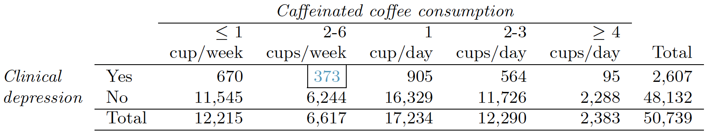

```{r setup, include=FALSE}
knitr::opts_chunk$set(echo = TRUE)
set.seed(1204)
```

--- 


--- 

## Section 6.1 problems

### Problem 1: Elderly Drivers. (Modification of OIS Problem 6.6)

The New Marist Poll published a report stating that 25% of adults nationally think licensed rivers should be required to retake their road test once they reach 65 years of age.  It was also reported that interviews were conducted on 1,018 American adults, and that the margin of error was 3% using a 90% confidence level.

(a)  Verify the margin of error reported by The New Marist Poll.

(b)  Based on a 90% confidence interval, does the poll provide convincing evidence that more  than 20% of the population think that licensed drivers should be required to retake their road test once they turn 65?

### Problem 2: Legalize Marijuana,  Part I. (Modification of OIS Problem 6.10)

The  General  Social  Survey  asked  1,578  US  residents:  “Do  you think the use of marijuana should be made legal, or not?”  61% of the respondents said it should be made legal.

(a)  Is 61% a sample statistic or a population parameter?  Explain.
(b)  Construct a 99% confidence interval for the proportion of US residents who think marijuana should be made legal, and interpret it in the context of the data.
(c)  A critic points out that this 99% confidence interval is only accurate if the statistic follows a normal distribution, or if the normal model is a good approximation.  Is this true for these data?  Explain.
(d)  A news piece on this survey’s findings states, “The Majority of Americans think marijuana should be legalized.”  Based on your confidence interval, is this news piece’s statement justified?

### Problem 3: Is college worth it? Part I. (OIS Problem 6.12)

Among a simple random sample of 331 American adults who do not have a four-year college degree and are not currently enrolled in school, 49% said they decided not to go to college because they could not afford school.

(a)  A newspaper article states that only a minority of the Americans who decide not to go to college do so because they cannot afford it and uses the point estimate from this survey as evidence.  Conduct a hypothesis test to determine if these data provide strong evidence supporting this statement.
(b)  Would you expect a confidence interval for the proportion of American adults who decide not to go to college because they cannot afford it to include 0.5?  Explain.

### Problem 4: Legalize Marijuana,  Part II. (Modification of OIS Problem 6.16)

As discussed  in Problem 1, the  General  Social  Survey reported  a sample where about 61% of US residents thought marijuana should be made legal.  If we wanted to limit the margin of error of a 99% confidence interval to 2%, about how many Americans would we need to survey?


## Section 6.2 problems


### Problem 5: Sleep deprivation, CA vs. OR, Part I. (Modification of OIS Problem 6.22)

According to a report on sleep deprivation by the Centers for Disease Control and Prevention, the proportion of California residents who reported insufficient rest or sleep during  each  of  the  preceding  30  days  is  9.0%,  while  this proportion  is  9.8%  for  Oregon residents.   These data are based on simple random samples of 11,545 California and 4,691 Oregon residents.  Calculate a 90% confidence interval for the difference between the proportions of Californians and Oregonians who are sleep deprived and interpret it in context of the data.


### Problem 6: Sleep deprivation, CA vs. OR, Part II. (Modification of OIS Problem 6.24)

Problem 4 provides data on sleep deprivation rates of Californians and Oregonians. The proportion of California residents who reported insufficient rest or sleep during each of the preceding 30 days is 9.0%, while this proportion is 9.8% for Oregon residents. These data are based on simple random samples of 11,545 California and 4,691 Oregon residents.

(a) Conduct a hypothesis test to determine if these data provide strong evidence of the rate of sleep
deprivation is different for the two states. (Reminder: Check conditions.)

(b) It is possible the conclusion of the test in part (a) is incorrect. If this is the case, what type
of error was made?


## Section 6.3 problems

### Problem 7: Wearing masks (Modification of OIS Problem 6.32)

In a random sample 823 adults in the United States, 461 say they plan to always wear a mask in public in the next two months.
Determine if the statements below are true or false. For each false statement,suggest an alternative wording to make it a true statement.

(a)  As the degrees of freedom increases, the mean of the chi-square distribution decreases.
(b)  If you found $\chi^2$= 10 with df=5 you would reject $H_0$ at the 5% significance level.
(c)  When finding the p-value of a chi-square test, we always shade the tail areas in one tail.
(d)  As the degrees of freedom increases, the variability of the chi-square distribution increases.

### Problem 8: Barking deer (Modification of OIS Problem 6.34)

Microhabitat factors associated with forage and bed sites of barking deer
in Hainan Island, China were examined from 2001 to 2002. In this region woods make up 4.8% of the land, cultivated grass plot makes up 14.7%, and deciduous forests make up 39.6%. Of the 852 sites where the deer forage, 8 were categorized as woods, 32 as cultivated grassplot, and 122 as
deciduous forests. To summarize these data: woods = 8; cultivated grassplot= 32; Deciduous forests = 122; other = 690; total  = 852.

(a) Write the hypotheses for testing if barking deer prefer to forage
in certain habitats over others.
(b) What type of test can we use to answer this research question?
(c) Check if the assumptions and conditions required for this test
are satisfied.
(d) Do these data provide convincing evidence that barking deer prefer to forage in certain habitats over others? Conduct an appropriate hypothesis test to answer this research question.


## Section 6.4 problems


### Problem 9: Diabetes and unemployment. (OIS Problem 6.46)

A  Gallup  poll  surveyed  Americans  about  their  employment  statusand whether or not they have diabetes.  The survey results indicate that 1.5% of the 47,774 employed (full or part time) and 2.5% of the 5,855 unemployed 18-29 year olds have diabetes.

(a)  Create a two-way table presenting the results of this study.
(b)  State  appropriate hypotheses to test for difference in proportions  of  diabetes between employed  and unemployed Americans.
(c)  The sample difference is about 1%.  If we completed the hypothesis test, we would find that the p-value is very small (about 0), meaning the difference is statistically significant.  Use this result to explain the difference between statistically significant and practically significant findings.


### Problem 10: Coffee and Depression. (OIS Problem 6.50)

Researchers conducted a study investigating the relationship between caffeinated coffee consumption and risk of depression in women.  They collected data on 50,739 women free of depression symptoms at the start of the study in the year 1996, and these women were followed through 2006.The researchers used questionnaires to collect data on caffeinated coffee consumption, asked each individual about physician-diagnosed depression, and also asked about the use of antidepressants.  The table below shows the distribution of incidences of depression by amount of caffeinated coffee consumption



(a) What type of test is appropriate for evaluating if there is an association between coffee intake
and depression?
(b) Write the hypotheses for the test you identicated in part (a).
(c) Is the ratio of women who do and do not suffer from depression proportion?
(d) Identify the expected count for the highlighted cell, and calculate the contribution of this cell
to the test statistic, i.e. $(Observed - Expected)^2=Expected$.
(e) The test statistic is $\chi^2=4.14$. What is the p-value?
(f) What is the conclusion of the hypothesis test?
(g) One of the authors of this study was quoted on the NY Times as saying it was too early to recommend that women load up on extra coffee" based on just this study. Do you agree with this statement?
Explain your reasoning.

