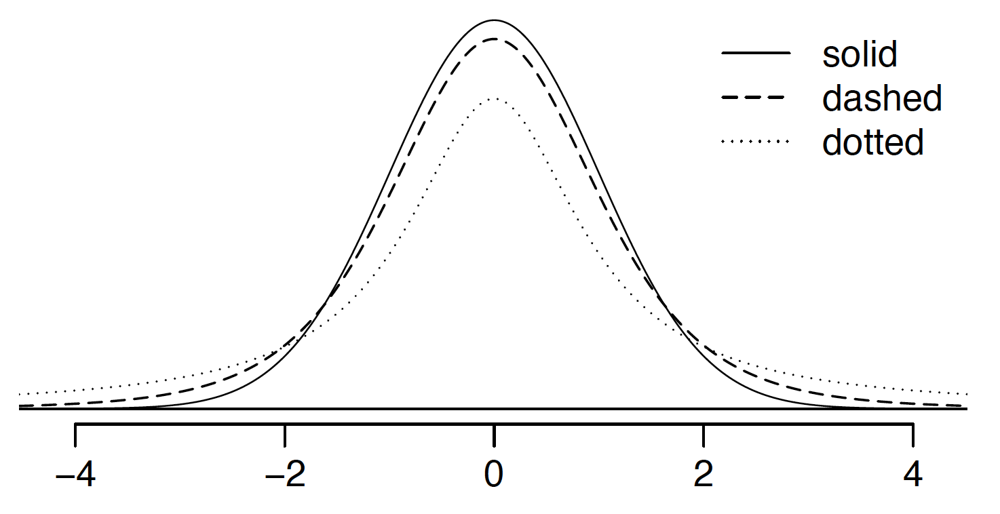

```{r setup, include=FALSE}
knitr::opts_chunk$set(echo = TRUE)
set.seed(1204)
```

--- 

## Section 7.1 problems

--- 

### Problem 1: $t$-distribution

The figure below shows three unimodal and symmetric curves: the standard
normal (z) distribution, the $t$-distribution with 5 degrees of freedom, and the $t$-distribution with 1 degree of freedom. Determine which is which, and explain your reasoning.

Note that another way of viewing this question is: which of these distributions puts the most probability in 'extreme' values (i.e. values far from 0), and which puts the least? (You can see this in the the figure -- one distribution has the thinnest 'tails'.)



### Problem 2: Find the p-value

An independent random sample is selected from an approximately normal population with an unknown standard deviation. Find the p-value for the given sample size and test statistic.. Also determine if the null hypothesis would be rejected at $\alpha = 0.01$.

(a) $n = 36, \ T = 2.585$
(b) $n = 15, \ T = 0.75$

### Problem 3: Working backwards

A 99% confidence interval for a population mean is (13, 25). The
population distribution is approximately normal and the population standard deviation is unknown. This confidence interval is based on a simple random sample of 31 observations. Calculate the sample mean, the margin of error, and the sample standard deviation.

### Problem 4: Environmental exposure to radon

Researchers interested in environmental exposure to radon in a small town in northern New Mexico sampled the blood of 47 park rangers subjected to possibly damaging levels of environmental radon levels while working in a primarily rural environment. The blood samples of these rangers had an average
radon concentration of 744.3 Bq m$^{−3}$ and a SD of 82.7 m$^{−3}$; a previous study of individuals from a different location in New Mexico, with no history of exposure, found an average blood level concentration of 417.2 m$^{−3}$

(a) Write down the hypotheses that would be appropriate for testing if the park rangers appear to have been exposed to a different concentration of radon
(b) Explicitly state and check all conditions necessary for inference on these data.
(c) Regardless of your answers in part (b), test the hypothesis that the park rangers have a higher radon exposure than the group in the previous study. Interpret your results in context.

--- 

## Section 7.2 problems

--- 

### Problem 5: True / False paired

Determine if the following statements are true or false. If false, explain.

(a) Consider two datasets of different sizes. These can be analyzed as paired data if you average the extra observations first.
(b) Consider two datasets that are paired with each other. Each observation in one data set has a natural correspondence with exactly one observation from the other data set.
(c) Consider two sets of data that are paired with each other. Each observation in one data set is subtracted from the average of the other data set's observations.
(d) In a paired analysis we first take the difference of each pair of observations, and then we do inference on these differences.
(e) If we randomly sample a set of individuals and then flip a coin to put each of them into one of two groups, it is natural to pair each individual in one group to someone in the other so long as the sample size is the same.

### Problem 6: Pre-med prowess

Duke University conducted a survey of pre-med students, collecting test data on chemistry, biology, physics, and several other subjects. Here we examine a
simple random sample of 300 students from this survey. Side-by-side box plots of chemistry and biology scores as well as a histogram of the differences in scores are shown below.

```{r echo=F}
par(mfrow=c(1,2))
set.seed(1204)
n=300
chem <- rnorm(n, sd=7, mean=50)
biol <- rnorm(n, sd=5, mean=50)
df <- data.frame(test=c(rep('chem',n), rep('bio',n)), score=c(chem,biol))
boxplot(data=df, score~test, las=2, xlab='')
points(factor(df$test), df$score, col=3)
hist(chem - biol, xlab='Difference in scores (chem - bio)')
```

(a) Is there a clear difference in the average chemistry and biology scores?
(b) Are the chemistry and biology scores of each student independent of each other?
(c) Create hypotheses appropriate for the following research question: is there an evident difference in the average scores of students in the chemistry and biology exam?
(d) Check the conditions required to complete this test.
(e) The average observed difference in scores is $\bar{x}_{chem-bio}$=`r round(mean(chem - biol),3)`, and the standard deviation of the
differences is `r round(sd(chem - biol),3)` points. Do these data provide convincing evidence of a difference between the average scores on the two exams?
(f) What type of error might we have made? Explain what the error means in the context of the application.
(g) Based on the results of this hypothesis test, would you expect a confidence interval for the average difference between the chemistry and biology scores to include 0? Explain your reasoning.

--- 

## Section 7.3 problems

--- 


--- 

## Section 7.4 problems

--- 


--- 

## Section 7.5 problems

--- 
